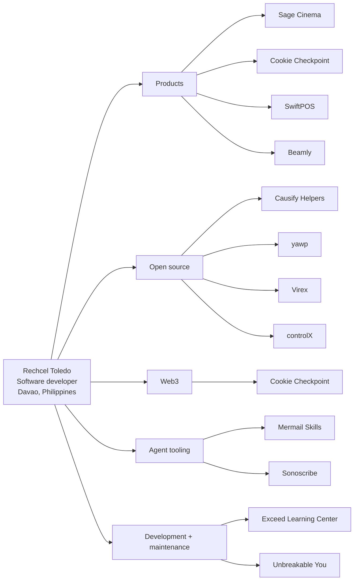

# Rechcel Toledo — Software Developer, phcodesage

Hi, I’m Rechcel Toledo. I run phcodesage, a one-person product studio based in Davao, Philippines, and I still ship the code. I build thoughtful digital products across frontend, backend, open source, on-chain applications, and agent tooling.

I enjoy turning rough ideas into clear, useful experiences—from polished interfaces and API-driven products to developer tools and blockchain experiments. I care about good product decisions, maintainable code, and the small details that make software feel considered.

## Live site

Visit the live portfolio at [phcodesage.github.io](https://phcodesage.github.io/).

The portfolio uses the bundled portrait at `assets/rechcel-portrait.png` for the header and profile card, with a square favicon crop at `assets/favicon.png`.

## Portfolio

- [Cookie Checkpoint](https://cookie-checkpoint.vercel.app) — an open-source on-chain streak app for Cookie Chain.
- [Sage Cinema](https://sage-cinema-nu.vercel.app/) — a TMDB-powered movie discovery experience with search, recommendations, and watch history.
- [Mermail Skills](https://github.com/phcodesage/mermail-skills) — portable agent workflows for email, scheduling, support, and GTM automation.
- [Causify Helpers contribution](https://github.com/causify-ai/helpers/pull/1396) — a Python AST-based private-function linter with tests and actionable diagnostics.

## Also in the portfolio

- [yawp](https://github.com/phcodesage/yawp) — a private, fully local macOS dictation tool built in Swift.
- [Sonoscribe](https://github.com/phcodesage/sonoscribe-drop) — a timestamped audio/video transcription and AI workspace.
- [SwiftPOS](https://github.com/phcodesage/Swift-Pos) — a browser-based point-of-sale system for small Philippine stores.
- [SageMovies TUI](https://github.com/phcodesage/sagemovies-tui) — a keyboard-first Rust terminal interface for movies and series.
- [Virex](https://github.com/phcodesage/Virex) — a native macOS writing assistant built with Rust, Tauri, and SolidJS.
- [Beamly](https://github.com/phcodesage/beamly) — an end-to-end encrypted peer-to-peer file transfer app.
- [ApplyPH AI](https://github.com/phcodesage/applyph) — an AI job-search assistant for Filipino job seekers.
- [controlX](https://github.com/phcodesage/controlX) — a low-latency remote desktop system using Rust and WebRTC.
- [Sage Movies source](https://github.com/phcodesage/sage_movies) — the open-source movie platform behind Sage Cinema.

## Clients & stewardship

- [Unconventional Psychotherapy](https://unconventionalpsychotherapy.com/about/) — psychotherapy practice platform.
- [Tri-State Coach Bus](https://tristatecoachbus.net/) — coach and group transportation platform.
- [Exceed Learning Center](https://www.exceedlearningcenterny.com/) — education, tutoring, enrichment, and test-prep platform. I’m the developer and maintainer.
- [Unbreakable You](https://unbreakable-you.com/) — healing and empowerment coaching platform. I’m the developer and maintainer.

## Work history

The experience section on the site is based on the public history in [portfolioV2](https://github.com/phcodesage/portfolioV2):

- **Onlinejobs.ph** (Aug 2023 — Present) — Software Developer, building real-time communication systems with Flask, WebRTC, and WebSockets.
- **Udemy** (Jun — Aug 2023) — Web Development Instructor, creating practical front-end and back-end courses.
- **Purple Roof** (March — May 2023) — Junior Frontend Developer, contributing to mortgage platform features.
- **Rooche Digital** (Dec 2022 — Mar 2023) — Backend Python Developer, developing and maintaining ecommerce APIs.

## Practice

- Frontend: React, Next.js, responsive interfaces, interaction design
- Backend: APIs, data flows, integrations, testing, maintainability
- Web3: Solana-compatible applications, wallets, RPC, on-chain UX
- Agent tooling: MCP servers, portable skills, and workflow automation

## Work graph

## GitHub activity

## Office

- Email: [rechceltoledo@gmail.com](mailto:rechceltoledo@gmail.com)
- GitHub: [@phcodesage](https://github.com/phcodesage)
- Instagram: [@phcodesage](https://www.instagram.com/phcodesage/)
- Threads: [@phcodesage](https://www.threads.com/@phcodesage)
- X: [@phcodesage](https://x.com/phcodesage)
