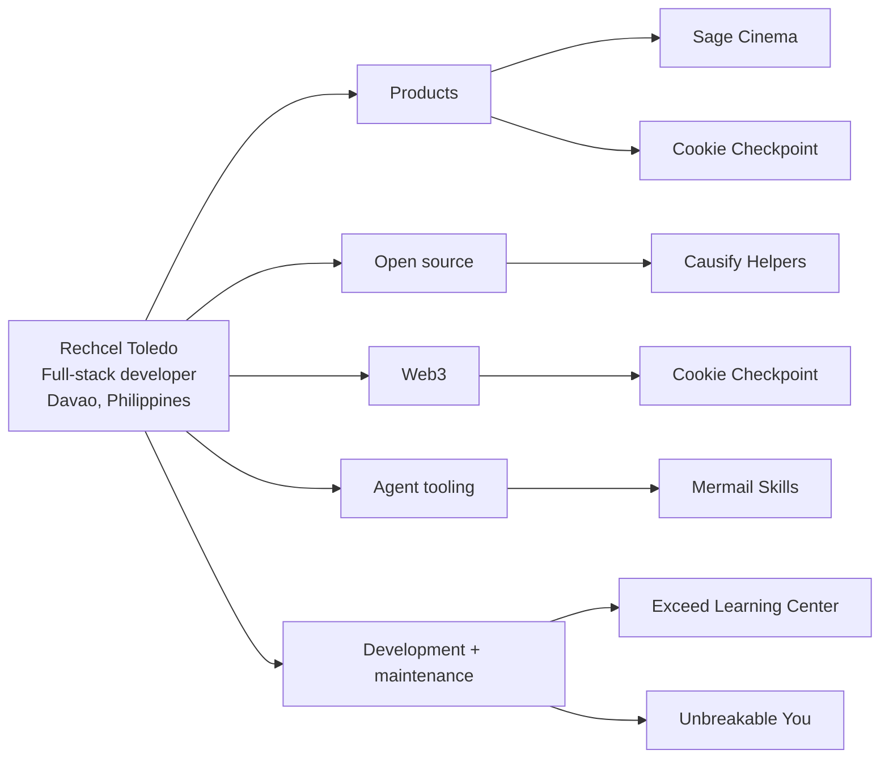

# Rechcel Toledo — Developer Portfolio

Hi, I’m Rechcel Toledo, a full-stack developer based in Davao, Philippines. I build thoughtful digital products across frontend, backend, open source, on-chain applications, and agent tooling.

I enjoy turning rough ideas into clear, useful experiences—from polished interfaces and API-driven products to developer tools and blockchain experiments. I care about good product decisions, maintainable code, and the small details that make software feel considered.

## Portfolio

Visit the live portfolio at [phcodesage.github.io](https://phcodesage.github.io/).

## Selected work

- [Cookie Checkpoint](https://cookie-checkpoint.vercel.app) — an open-source on-chain streak app for Cookie Chain.
- [Sage Cinema](https://sage-cinema-jet.vercel.app) — a TMDB-powered movie discovery experience with search, recommendations, and watch history.
- [Mermail Skills](https://github.com/phcodesage/mermail-skills) — portable agent workflows for email, scheduling, support, and GTM automation.
- [Causify Helpers contribution](https://github.com/causify-ai/helpers/pull/1396) — a Python AST-based private-function linter with tests and actionable diagnostics.

## Development & maintenance

- [Exceed Learning Center](https://www.exceedlearningcenterny.com/) — education, tutoring, enrichment, and test-prep platform. I’m the developer and maintainer.
- [Unbreakable You](https://unbreakable-you.com/) — healing and empowerment coaching platform. I’m the developer and maintainer.

## Focus areas

- Frontend: React, Next.js, responsive interfaces, interaction design
- Backend: APIs, data flows, integrations, testing, maintainability
- Web3: Solana-compatible applications, wallets, RPC, on-chain UX
- Agent tooling: MCP servers, portable skills, and workflow automation

## Work graph

## GitHub activity

## Contact

- Email: [rechceltoledo@gmail.com](mailto:rechceltoledo@gmail.com)
- GitHub: [@phcodesage](https://github.com/phcodesage)
- Instagram: [@phcodesage](https://www.instagram.com/phcodesage/)
- Threads: [@phcodesage](https://www.threads.com/@phcodesage)
- X: [@phcodesage](https://x.com/phcodesage)
