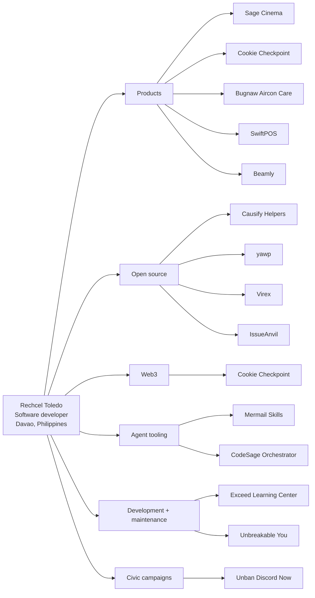

# Rechcel Toledo — Software Developer, phcodesage

Hi, I’m Rechcel Toledo. I run phcodesage, a one-person product studio based in Davao, Philippines, and I still ship the code. I build thoughtful digital products across frontend, backend, open source, on-chain applications, and agent tooling.

I enjoy turning rough ideas into clear, useful experiences—from polished interfaces and API-driven products to developer tools and blockchain experiments. I care about good product decisions, maintainable code, and the small details that make software feel considered.

## Live site

Visit the live portfolio at [phcodesage.github.io](https://phcodesage.github.io/).

You can also [view the resume](https://phcodesage.github.io/resume.html) or browse the [case studies](https://phcodesage.github.io/#work).

The About section uses the optimized `assets/rechcel-portrait.webp` portrait, with a 32-pixel favicon at `assets/favicon-32.png`. Original PNG assets remain available.

The personal gallery in About contains nine photos in `assets/about/`. Full-size WebP files preserve each supplied photo’s original dimensions at quality 90; photos wider than 640 pixels also have quality-85 previews for responsive loading. Select a photo to view it at full resolution, use the arrow keys or Previous/Next controls to browse, and press Escape to close. With JavaScript disabled, the gallery links open the WebP files directly.

## Portfolio

- [Bugnaw Aircon Care](https://bugnaw.lovable.app/) — a Metro Cebu aircon care booking experience with multilingual messaging, available slots, and reminders.
- [Unban Discord Now](https://unban-discord-now.pages.dev/) — a public campaign collecting Filipino workers’ stories and reports about Discord access disruptions.
- [Cookie Checkpoint](https://phcodesage.github.io/case-studies/cookie-checkpoint.html) — an open-source on-chain streak app for Cookie Chain. The hosted demo is currently unavailable; the case study links to its source and local setup instructions.
- [Sage Cinema](https://sage-cinema-nu.vercel.app/) — a TMDB-powered movie discovery experience with search, recommendations, and watch history.
- [Mermail Skills](https://github.com/phcodesage/mermail-skills) — portable agent workflows for email, scheduling, support, and GTM automation.
- [Causify Helpers contribution](https://github.com/causify-ai/helpers/pull/1396) — a Python AST-based private-function linter with tests and actionable diagnostics.

## Also in the portfolio

- [Jinjalume](https://phcodesage.github.io/jinjalume/) — open-source Tailwind UI components for Flask, Jinja, and Python web apps.
- [yawp](https://github.com/phcodesage/yawp) — a private, fully local macOS dictation tool built in Swift.
- [IssueAnvil](https://github.com/phcodesage/issueanvil) — a deterministic Rust CLI and GitHub Action for project housekeeping.
- [SwiftPOS](https://github.com/phcodesage/Swift-Pos) — a browser-based point-of-sale system for small Philippine stores.
- [SageMovies TUI](https://github.com/phcodesage/sagemovies-tui) — a keyboard-first Rust terminal interface for movies and series.
- [Virex](https://github.com/phcodesage/Virex) — a native macOS writing assistant built with Rust, Tauri, and SolidJS.
- [Beamly](https://github.com/phcodesage/beamly) — an end-to-end encrypted peer-to-peer file transfer app.
- [CodeSage Orchestrator](https://github.com/phcodesage/codesage-orchestrator) — a multi-agent Codex workflow with bounded roles and verification.
- [RemoteX](https://github.com/phcodesage/remoteX) — an attended remote-support foundation using Python, FastAPI, PySide6, and WebRTC.
- [Sage Movies source](https://github.com/phcodesage/sage_movies) — the open-source movie platform behind Sage Cinema.

## Clients & stewardship

- [Unconventional Psychotherapy](https://unconventionalpsychotherapy.com/about/) — psychotherapy practice platform.
- [Tri-State Coach Bus](https://tristatecoachbus.net/) — coach and group transportation platform.
- [Exceed Learning Center](https://www.exceedlearningcenterny.com/) — education, tutoring, enrichment, and test-prep platform. I’m the developer and maintainer.
- [Unbreakable You](https://unbreakable-you.com/) — healing and empowerment coaching platform. I’m the developer and maintainer.
- [Swim Studs](https://swimstuds.com/) — professional pool cleaning, maintenance, and repair services.
- [Ventured](https://www.venturedbrands.com/) — brand accelerator and consumer-brand portfolio platform.

## Work history

The experience section on the site is based on the public history in [portfolioV2](https://github.com/phcodesage/portfolioV2):

- **Onlinejobs.ph** (Aug 2023 — Present) — Software Developer, building real-time communication systems with Flask, WebRTC, and WebSockets.
- **Udemy** (Jun — Aug 2023) — Web Development Instructor, creating practical front-end and back-end courses.
- **Purple Roof** (March — May 2023) — Junior Frontend Developer, contributing to mortgage platform features.
- **Rooche Digital** (Dec 2022 — Mar 2023) — Backend Python Developer, developing and maintaining ecommerce APIs.

## Practice

- Frontend: React, Next.js, responsive interfaces, interaction design
- Backend: APIs, data flows, integrations, testing, maintainability
- Web3: Solana-compatible applications, wallets, RPC, on-chain UX
- Agent tooling: MCP servers, portable skills, and workflow automation

## Work graph


```mermaid
flowchart LR
    R[Rechcel Toledo<br/>Software developer<br/>Davao, Philippines]
    R --> P[Products]
    R --> O[Open source]
    R --> W[Web3]
    R --> A[Agent tooling]
    R --> M[Development + maintenance]
    P --> P1[Sage Cinema]
    P --> P2[Cookie Checkpoint]
    P --> P5[Bugnaw Aircon Care]
    R --> C[Civic campaigns]
    C --> C1[Unban Discord Now]
    O --> O1[Causify Helpers]
    W --> W1[Cookie Checkpoint]
    A --> A1[Mermail Skills]
    A --> A2[CodeSage Orchestrator]
    M --> M1[Exceed Learning Center]
    M --> M2[Unbreakable You]
    P --> P3[SwiftPOS]
    P --> P4[Beamly]
    O --> O2[yawp]
    O --> O3[Virex]
    O --> O4[IssueAnvil]
```

## GitHub activity


## Office

- Email: [rechceltoledo@gmail.com](mailto:rechceltoledo@gmail.com)
- WhatsApp: [Message me](https://wa.me/639703224930)
- Telegram bot: [@phcodesage-portfolio](https://t.me/phcodesage-portfolio)
- GitHub: [@phcodesage](https://github.com/phcodesage)
- Instagram: [@phcodesage](https://www.instagram.com/phcodesage/)
- Threads: [@phcodesage](https://www.threads.com/@phcodesage)
- X: [@phcodesage](https://x.com/phcodesage)

## Local development

This is a static site. Generated Tailwind CSS is committed, so GitHub Pages does not need a build service and the pages do not compile CSS in visitors’ browsers.

```bash
npm ci
npm run build
python3 -m http.server 8765
```

Open `http://localhost:8765`. After changing utility classes in the homepage, Jinjalume gallery, or their scripts, run `npm run build` and commit the generated `assets/site.css` and `jinjalume/tailwind.css`. Hand-written styles live in `styles/site.css`, `jinjalume/site.css`, and `case-studies/styles.css`.

Project screenshots are stored locally in `assets/projects/`; capture sources are documented there. The contact form collects a reply number or username when WhatsApp or Telegram is selected. With JavaScript disabled, it submits through FormSubmit’s standard form endpoint using email as the reply channel.

## Visual design and motion

The portfolio uses a cinematic red, near-black, and ivory palette with DM Sans for reading and Barlow Condensed for display headings. Body copy is 17–19 pixels; labels and controls are generally 14–16 pixels. The homepage design lives in `styles/site.css`; case studies share `case-studies/styles.css`.

The hero sculpture is projected and drawn locally on a 2D canvas in `script.js`, with no additional animation dependency. It responds to the pointer and scroll position, stops drawing when off-screen or in a background tab, and supports the visible pause control and the system reduced-motion preference. Content and navigation remain usable without JavaScript. Project scenes use the existing optimized interface screenshots. A separate requestAnimationFrame callback updates project depth, rotation, backdrop lettering, and the chapter transition on native scroll events. The pause control and reduced-motion preference disable these scroll transforms.
